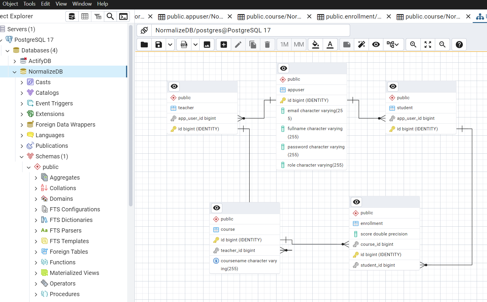

# Database Normalization in Student Management System API

In our Student Management System API, I have applied
normalization to organize data efficiently. In this document I have explained
how each level of normalization is achieved in the database schema.

## ER Diagram:

## 1st Normal Form (1NF) - Eliminating Repeating Groups To satisfy 1NF:

- Each table contains atomic (indivisible) values.
- Each column contains only a single type of data.
- Each row is uniquely identifiable

### Implementation : 
- The `Student`, `Course`, `Teacher`, and `Enrollment` entities have a unique primary key (`@Id`).
- No columns store multiple values

### Example : 
#### Before 1NF :- 
| StudentID | Name |  Courses                |
| :-------- || :-------- |:------------------------- |
| 1 |Shubham| Python, JAVA |
| 2 | Sandeep | JAVA |

#### After 1NF :-
- Student Table Isolated
| StudentID |  Name                |
| :-------- |:------------------------- |
| 1 | Shubham |
| 2 | Sandeep |
- Isolated Enrollment Table
| EnrollmentId | StudentId |  CourseId                |
| :-------- || :-------- |:------------------------- |
| 1 |1| 1001|
| 2 | 1 | 1002 |
| 3 | 2 | 1002 |

## 2nd Normal Form (2NF) - Eliminating `Partial Dependency` to satisfy 2NF:

- The table must be in 1NF.
- All non-key attributes should be fully dependent on the primary key.

### Implementation : 
- The Enrollment table resolves the many-to-many relationship between Student and Course.

- Teacher is stored separately instead of being a column in Course

### Example : 
#### Before 2NF :- 
| CourseID | CourseName |  TeacherName                |
| :-------- || :-------- |:------------------------- |
| 1001 |Python| Harendra Bikrol|
| 1002 | JAVA | Anish Sahu |

#### After 2NF :-
| CourseID |  CourseName                |
| :-------- |:------------------------- |
| 1001 | Python |
| 1002 | JAVA |

| TeacherID |  TeacherName                |
| :-------- |:------------------------- |
| 1 | Harendra Bikrol |
| 2 | Anish Sahu |

| CourseID |  TeacherID                |
| :-------- |:------------------------- |
| 1001 |1 |
| 1002 | 2 |

## 3rd Normal Form (3NF) - Eliminating Transitive Dependency:

- The table must be in 2NF.

- Non-key columns must not depend on other non-key columns.

### Implementation:
- The `Teacher` entity is separate from `Course`, ensuring that `TeacherName` does not depend on `CourseName`.
- The `Enrollment` table ensures that student grades are linked directly to a specific course-student relationship.

### Example : 
#### Before 3NF :- 
| CourseID | CourseName |  TeacherName                |TeacherSubject               |
| :-------- || :-------- |:------------------------- |:------------------------- |
| 1001 |Python| Harendra Bikrol| Python |
| 1002 | JAVA | Anish Sahu | JAVA |

#### After 3NF :-
| CourseID |  CourseName                |
| :-------- |:------------------------- |
| 1001 | Python |
| 1002 | JAVA |

| TeacherID |  TeacherName                | Subject |
| :-------- |:------------------------- | :--------|
| 1 | Harendra Bikrol | Python|
| 2 | Anish Sahu | JAVA |

## Benefits of Normalization in this API
- `Efficient Storage : ` Reduces redundant storage of data.
- `Scalability : ` Allows easy addition of new features and modifications without affecting existing relationships.

